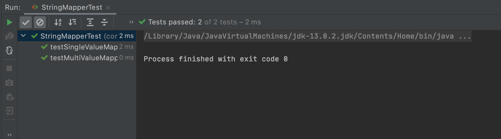

# Current Backend Interview Sample Repository

This repository serves as an example of the Java and OOP concepts you will need to be familiar with
in order to be successful in our interviews. Although much of Current's backend is in Java,
we want to be welcoming to all programming backgrounds in our interview process.
Getting up-to-speed in an entire programming language for an interview is a daunting task, so we've made this
sample repo to narrow down the scope of what you'll need to understand.

This repo covers:
* Classes
* Object Instantiation
* Interfaces
* Generic Types
* Iteration & Arrays
* Conditionals
* Assertions
* Unit Testing

This is not meant to be a study guide, but more of a reference to ease the process of interviewing in
an unfamiliar language. If at any point during our interview process you forget the Java patterns or idioms
for doing anything at all, you are encouraged to ask. All of our programming interviews are collaborative in
nature, and we will do our best to guide you through them painlessly.

## Instructions
Follow these steps to set up your IDE:

1. The best IDE for this interview (and the most widely-used Java IDE) is IntelliJ IDEA. [Download the
  Community Edition here.](https://www.jetbrains.com/idea/download/)
2. Open this repository in IntelliJ (`File -> Open -> /path/to/repo/root`).
3. Select a Java Development Kit (JDK) to build the project and run the examples
(`File -> Project Structure -> Project Settings -> Project -> Project SDK -> select one`).
    * If there is no installed SDK on your machine, you can select "Add SDK" and download a new one.
4. Build the project (`Build -> Build Project`).
5. Run the tests:
    * Go into `src/main/java/com/current/StringMapperTest`
    * Run the tests using the IDE (`Run -> Run StringMapperTest`).
    * You should see something like this appear at the bottom of the IDE window:
    
6. Try out the debugger:
    * Navigate into the `UserInfoMapper` class.
    * Insert a breakpoint on line 34 by clicking on the margin to the right of the line number.
    * Go into `src/main/java/com/current/StringMapperTest`
    * Run the tests using the built-in debugger (`Run -> Debug StringMapperTest`).
    * The test execution should pause at line 33 of `UserInfoMapper`, at which point you can
      click around and investigate the program state.

If you can successfully go through these steps, then you will be able to do our interviews no problem.

Good luck!